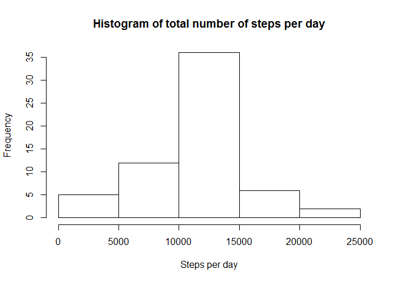
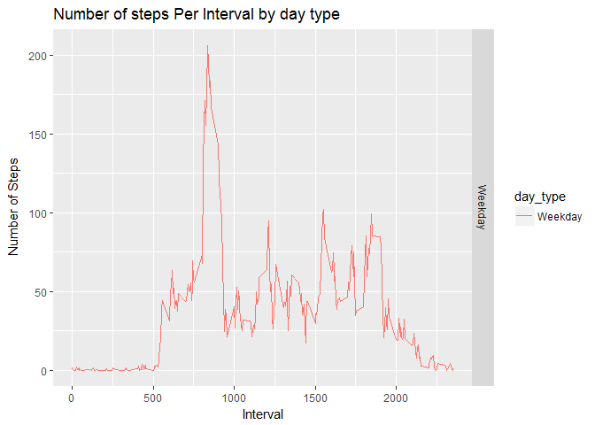

# Reproducible Research: Peer Assessment 1

## Loading and preprocessing the data

```r
activity <- read.csv("activity.csv", as.is = TRUE)
good_activity <- activity[complete.cases(activity), ]
```

## What is mean total number of steps taken per day?

```r
#calculating total steps per day
steps_per_day <- aggregate(steps ~ date, good_activity, sum)

#histogram of the steps per day 
hist(steps_per_day$steps, main = "Histogram of total number of steps per day", xlab = "Steps per day")
```

<!-- -->

```r
#calculating the mean and the median
round(mean(steps_per_day$steps))
```

```
## [1] 10766
```

```r
median(steps_per_day$steps)
```

```
## [1] 10765
```

## What is the average daily activity pattern?

```r
# Calculate average steps per interval for all days 
avg_steps_per_interval <- aggregate(steps ~ interval, good_activity, mean)

# Plot the time series with appropriate labels and heading
plot(avg_steps_per_interval$interval, avg_steps_per_interval$steps, type='l', col=1, main="Average number of steps by Interval", xlab="Time Intervals", ylab="Average number of steps")
```

<!-- -->

```r
# Identifying the interval index which has the highest average steps
interval_idx <- which.max(avg_steps_per_interval$steps)

# Identifying the specific interval and the average steps for that interval
avg_steps_per_interval[interval_idx, ]$interval
```

```
## [1] 835
```

```r
avg_steps_per_interval[interval_idx, ]$steps
```

```
## [1] 206.1698
```

## Imputing missing values

```r
#strategy to replace the missing NA values with the average steps in that interval across all the days
missing_value<- activity[!complete.cases(activity), ]
nrow(missing_value)
```

```
## [1] 2304
```

```r
#For each Na identifying the interval for that row then identifying the avg steps for that interval and changing the NA value with that value
for (i in 1:nrow(activity)) {
  if(is.na(activity$steps[i])) {
    a<- avg_steps_per_interval$steps[which(avg_steps_per_interval$interval == activity$interval[i])]
    activity$steps[i] <- a 
  }
}
# Steps per day with the filled values
steps_per_day_filled <- aggregate(steps ~ date, activity, sum)
# Histogram of the value 
hist(steps_per_day_filled$steps, main = "Histogram of total number of steps per day", xlab = "Steps per day")
```

<!-- -->

```r
# Calculating the mean and median of the total number of steps again with filled NAs
round(mean(steps_per_day_filled$steps))
```

```
## [1] 10766
```

```r
median(steps_per_day_filled$steps)
```

```
## [1] 10766.19
```

## Are there differences in activity patterns between weekdays and weekends?

```r
#Appliying the wwek day function
weekday <- function(date_val) {
  wd <- weekdays(as.Date(date_val, '%Y-%m-%d'))
  if  (!(wd == 'Saturday' || wd == 'Sunday')) {
    x <- 'Weekday'
  } else {
    x <- 'Weekend'
  }
  x
}
# Adding the new column to activity dataset with week day
activity$day_type <- as.factor(sapply(activity$date, weekday))
library(ggplot2)
```

```
## Warning: package 'ggplot2' was built under R version 3.3.3
```

```r
# Creating data frame by intervals and day_type
steps_per_day_filled <- aggregate(steps ~ interval+day_type, activity, mean)

# Creating the plot
plot_activity <- ggplot(steps_per_day_filled, aes(interval, steps)) +
  geom_line(stat = "identity", aes(colour = day_type)) +
  theme_gray() +
  facet_grid(day_type ~ ., scales="fixed", space="fixed") +
  labs(x="Interval", y=expression("Number of Steps")) +
  ggtitle("Number of steps Per Interval by day type")
print(plot_activity)
```

<!-- -->

